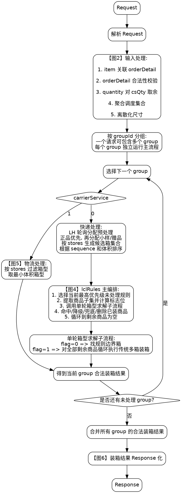
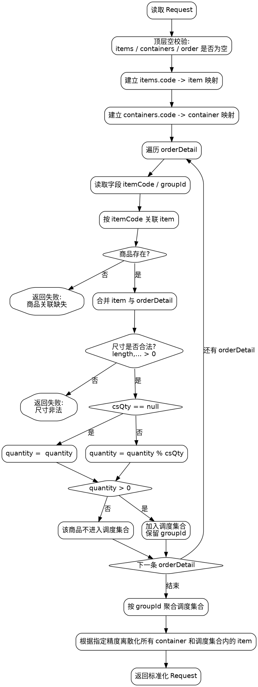
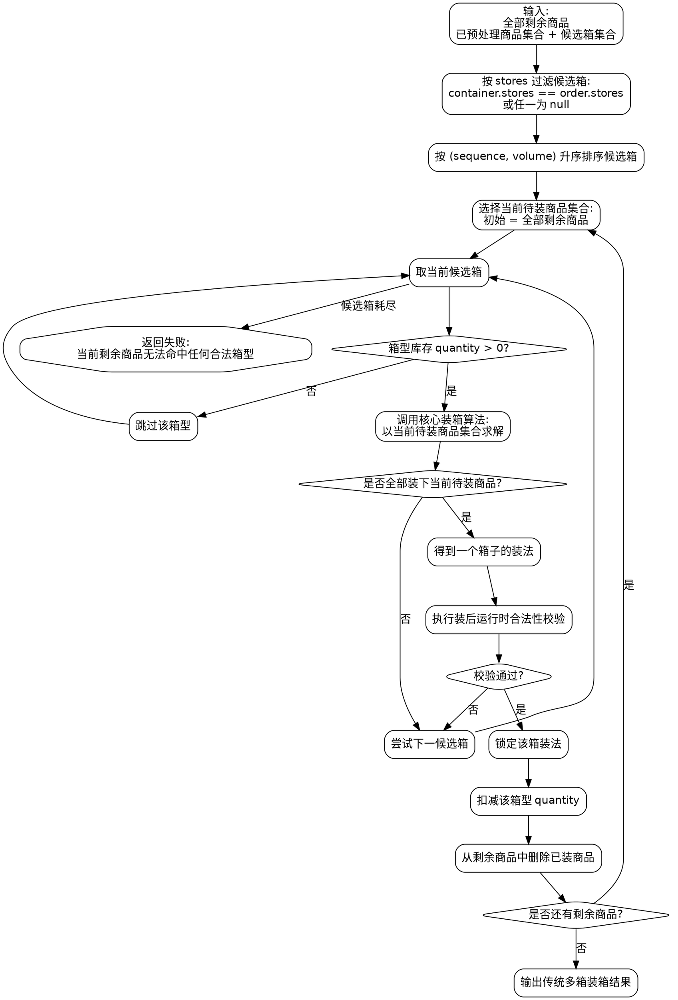
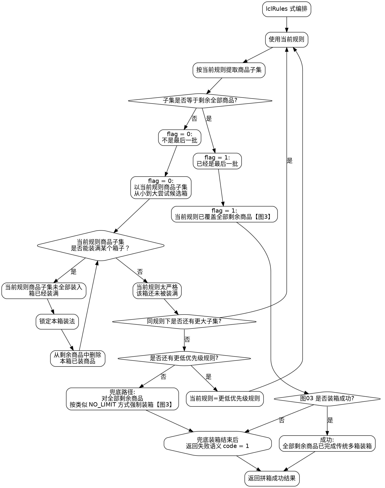
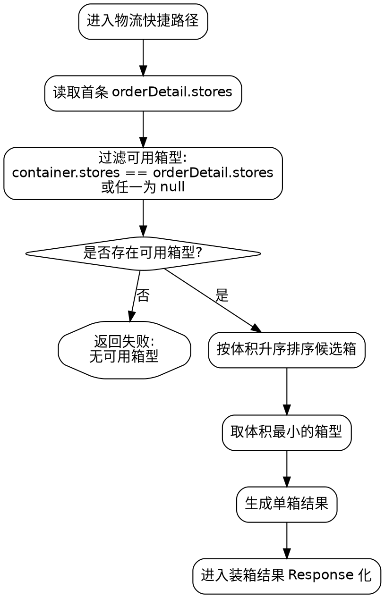
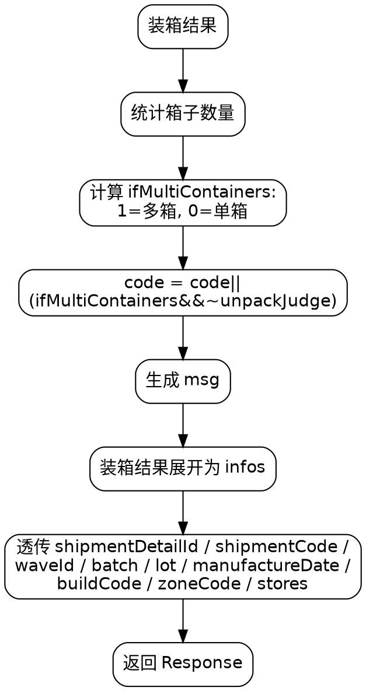

# 程序流程图

## 1. 说明

本文档基于 `参数列表.md` 绘制完整程序流程，而不是只描述核心装箱算法内部过程。

本版统一使用 `Graphviz DOT` 表达流程图，原因如下：

- 纯本地可编译，不依赖在线渲染。
- 可直接输出 `svg / png / pdf`。
- 适合正式交付时纳入文档或汇报材料。

推荐本地编译命令：

```bash
dot -Tsvg total-flow.dot -o total-flow.svg
dot -Tpng total-flow.dot -o total-flow.png
```

本文档不再只停留在“阶段框图”层面，而是把每张图细化到参数级逻辑。每张图都包含：

- `DOT` 流程图
- 节点说明
- 参数/判断/输出说明

## 2. 总流程图



### 总图说明

- `输入标准化`
    - 这里已经开始执行业务规则，而不是单纯结构解析。
    - 核心动作是 `itemCode` 关联、`csQty` 取余、散件展开。
- `groupId 分组`
    - 一个请求中的 `order` 可以包含多个 `groupId`。
    - 后续快递或物流主流程均在单个 `groupId` 内独立执行。
    - 所有 group 完成后，再把结果合并为一次请求的统一出参。
- `carrierService`
    - 这是请求级字段，只取第一条 `orderDetail` 判定。
- `快递正常路径`
    - 先执行 `LH` 轮询分配预处理：在当前 group 内挑出所有 `LH`，正品优先分配，再分配小样和赠品，尽量均匀分散到所有 `LH`。
    - 没有 `LH` 时，散件直接进入外层 container 调度。
    - 不存在“跳过 `lclRules` 的纯正常装箱主线”。
    - 真正的快递编排永远由 `lclRules` 驱动。
- `物流快捷路径`
    - 不是核心装箱算法路径，而是箱型选择快捷路径。
- `合法装箱结果集合`
    - 这里的“合法”是指每个已锁定箱子都已经在运行时通过 `maxWeight / capacityRate` 等校验。
    - 因此总流程在这里之后不再重新做一遍“换箱式校验”。
- `code / msg`
    - 最后统一计算，不在中途写死。

### 总图参数逻辑

| 节点       | 关键参数                           | 判断逻辑                                                   | 结果                     |
| ---------- | ---------------------------------- | ---------------------------------------------------------- | ------------------------ |
| 输入标准化 | `items.code`, `order.itemCode`     | 必须能关联                                                 | 否则失败                 |
| 输入标准化 | `quantity`, `csQty`                | 若 `csQty != null`，则 `quantity % csQty`                  | 余数才进入调度           |
| 分组调度   | `groupId`                          | 按相同 `groupId` 聚合调度商品                             | 每个 group 独立运行主流程 |
| 请求分流   | `carrierService`                   | `0=快递`, `1=物流`                                         | 进入不同路径             |
| 快递路径   | `lclRules`                         | 始终进入规则编排，不存在关闭开关                           | `lclRules` 是主线        |
| 规则编排   | `flag`                             | `1=当前子集即全部剩余商品`, `0=仍有剩余商品未纳入当前子集` | 决定后续求解目标         |
| 运行时校验 | `maxWeight`, `capacityRate`        | 在锁定某个箱子前完成；任一不满足则继续换箱                 | 决定该箱能否进入结果集合 |
| 结果计算   | `unpackJudge`, `ifMultiContainers` | 按接口文档表达式计算                                       | 决定 `code`              |

## 3. 子图一：输入标准化与前置校验



### 子图一说明

- 该阶段产出的是“标准化请求上下文”，不是装箱结果。
- `csQty` 的语义必须在这里消费掉，不能留给核心算法。
- 当前接口事实只明确“散件进入调度”，并未明确“整箱部分是否要体现在出参中”，因此该点保留为后续设计项。

### 子图一参数逻辑

| 参数                                           | 使用阶段     | 判断/处理逻辑                  | 输出影响         |
| ---------------------------------------------- | ------------ | ------------------------------ | ---------------- |
| `itemCode`                                     | 订单明细关联 | 必须能在 `items.code` 中找到   | 找不到则失败     |
| `length/width/height`                          | 商品标准化   | 必须合法，后续还要统一精度缩放 | 非法则失败       |
| `quantity`                                     | 数量处理     | 原始订单数量                   | 与 `csQty` 配合  |
| `csQty`                                        | 数量处理     | `null` 则不取余，否则执行 `%`  | 决定散件数量     |
| `allowDown`                                    | 调度准备     | 保留到姿态裁剪阶段             | 影响后续可用姿态 |
| `itemCategory1`                                | 调度准备     | 保留到礼盒/散件逻辑阶段        | 影响商品归类     |
| `stores`                                       | 调度准备     | 透传到候选箱过滤，空值只接受 `null` | 影响箱型可用性   |
| `groupId`                                      | 调度分组     | 相同 `groupId` 的调度商品归为一组 | 决定算法主流程运行边界 |
| `batch/lot/manufactureDate/buildCode/zoneCode` | 调度准备     | 保留到 `lclRules` 阶段         | 影响规则分组     |
| `carrierService`                               | 请求分流     | 理论上所有明细相同，取首条     | 决定主路径       |
| `maxWeight/capacityRate`                       | 箱型标准化   | 此阶段只保留，不校验           | 运行时校验使用   |

## 4. 子图二：传统多箱装箱子流程（供 `lclRules` 复用）



### 子图二说明

- 该图表达的是“传统多箱装箱”本身，职责是：给定一批待装商品，循环选择箱型并反复调用核心算法，直到全部装完或彻底失败。
- 它本身不负责 `lclRules` 规则选择，也不负责“刚好装不下”的规则边界判定。
- 在 `lclRules` 中，`flag = 1` 分支应直接跳转复用本图，因为此时当前规则子集已经等于全部剩余商品，目标就是传统意义上的“把所有剩余商品装完”。
- `flag = 0` 分支通常不会整图复用本图，而是只复用其中的局部能力：候选箱过滤、排序、调用核心算法、装后运行时合法性校验。
- 礼盒处理和姿态处理都在进入该子流程之前完成，核心算法只消费处理后的商品集合。

### 子图二参数逻辑

| 参数                          | 使用阶段   | 判断/处理逻辑                                       | 输出影响         |
| ----------------------------- | ---------- | --------------------------------------------------- | ---------------- |
| `stores`                      | 箱型过滤   | `container.stores == orderDetail.stores` 或任一为空 | 决定候选箱集合   |
| `sequence`                    | 箱型排序   | 升序优先                                            | 决定尝试顺序     |
| `volume(length*width*height)` | 箱型排序   | 与 `sequence` 组成字典序                            | 决定尝试顺序     |
| `quantity`                    | 箱型库存   | 每锁定一个箱子扣减一次                              | 防止超用箱型     |
| 全部剩余商品                  | 本流程输入 | 以全部剩余商品为目标，必要时多次运行算法直到装完    | 形成最终多箱结果 |
| `maxWeight`                   | 运行时校验 | 非空时校验累计重量                                  | 不合法则换箱     |
| `capacityRate`                | 运行时校验 | 非空时比较利用率                                    | 不合法则换箱     |

## 5. 子图三：`lclRules` 拼箱优先级编排



### 子图三说明

- `lclRules` 不是可选开关，而是快递主路径的核心编排器。
- 每一轮都使用当前规则提取商品子集；当当前规则无法继续产出满箱时，再进入同规则更大子集或更低优先级规则。
- `flag = 0` 时，目标不是“把当前规则子集装完”，而是用当前规则去产出一个真正装满的箱子。
- 因此判定逻辑是：
    - 如果当前规则商品子集在当前候选箱里还能全部装下，说明当前规则太严格，这个箱子还没有被装满，不能锁箱。
    - 此时优先判断同规则下是否还有更大子集；若有，则继续使用当前规则提取更大子集。
    - 若同规则下没有更大子集，再切到更低优先级规则，把更多商品纳入可混装集合。
    - 只有当当前规则商品子集在当前候选箱里装不完时，才说明当前箱子已经达到“对当前规则来说刚好装不下”的边界，此时锁定该箱装法。
- `flag = 0` 成功一次只会固定一个满箱；剩余商品全部回到调度区，再重新进入规则选择。
- `flag = 0` 且已经没有更低优先级规则时，直接对全部剩余商品执行兜底装箱，但业务语义仍返回失败 `code = 1`。
- `flag = 1` 时，当前规则已经覆盖全部剩余商品，此时直接转入图 03 的传统多箱装箱流程。
- 图 03 的作用是提供一个稳定的“把给定商品集合完整装完”的执行器：
    - 在 `flag = 1` 时，它承担正式成功装箱；
    - 在 `flag = 0` 无法继续降级时，它承担兜底强制装箱，但业务结果仍记失败。

### 子图三参数逻辑

| 参数                                       | 使用阶段          | 判断/处理逻辑                                            | 输出影响                           |
| ------------------------------------------ | ----------------- | -------------------------------------------------------- | ---------------------------------- |
| `lclRules.sequence`                        | 规则调度          | 升序选择优先级最高规则                                   | 决定规则顺序                       |
| `lclRules.code`                            | 子集提取          | 按字段组合生成当前规则商品子集                           | 决定当前待装商品子集               |
| `itemCode + batch + lot + manufactureDate` | `SAME_SKU_LOT`    | 完全相同归一组                                           | 形成子集                           |
| `itemCode`                                 | `SAME_SKU`        | 相同归一组                                               | 形成子集                           |
| `buildCode + zoneCode`                     | `SAME_BUILD_ZONE` | 相同归一组                                               | 形成子集                           |
| `zoneCode`                                 | `SAME_ZONE`       | 相同归一组                                               | 形成子集                           |
| 全部剩余商品                               | `NO_LIMIT`        | 直接取全部剩余商品                                       | `flag` 一定为 `1`                  |
| `flag`                                     | 规则判定          | `1=当前子集就是全部剩余商品`, `0=仍有商品未纳入当前子集` | 决定是传统多箱装箱还是规则边界求解 |
| 当前规则商品子集是否全部装入当前候选箱     | `flag=0` 核心判定 | 若还能全部装下，说明当前规则过窄，当前箱未满             | 必须降级规则扩大商品集合           |
| 同规则下是否还有更大子集                   | `flag=0` 扩展判定 | 若有更大子集，继续保持当前规则并扩大子集                 | 优先于切换低优先级规则             |
| 当前规则商品子集是否存在未装商品           | `flag=0` 成功判定 | 只要当前规则子集装不完，就说明当前箱达到“刚好装不下”边界 | 当前箱可以锁定                     |
| 图 03 的装箱结果                           | `flag=1` 判定     | 图 03 成功则视为“刚好装下全部剩余商品”                   | 命中 `flag=1` 目标                 |
| 更低优先级规则是否存在                     | 降级判断          | 仅 `flag=0` 且当前规则求解失败时检查                     | 决定降级还是兜底                   |
| 兜底装箱结果                               | 失败语义          | 不论兜底是否装完，业务语义都标记 `code = 1`              | 决定最终状态码                     |

## 6. 子图四：物流快捷路径



### 子图四说明

- `carrierService = 1` 时不走正常极点装箱主流程，而是直接选箱。
- 文档明确写的是“直接选择对应 stores 的箱子中体积最小的那个返回”。
- 该路径不校验 `quantity / maxWeight / capacityRate`，只按 `stores` 和体积选择箱型。

### 子图四参数逻辑

| 参数                  | 使用阶段   | 判断/处理逻辑    | 输出影响           |
| --------------------- | ---------- | ---------------- | ------------------ |
| `carrierService`      | 请求分流   | `1` 时进入本路径 | 跳过正常装箱主流程 |
| `stores`              | 箱型过滤   | 与快递路径相同   | 决定可用箱型       |
| `length/width/height` | 最小箱选择 | 计算体积后升序   | 取最小箱           |

## 7. 子图五：结果汇总与出参组装



### 子图五说明

- `maxWeight / capacityRate` 仍然是接口规范要求，但它们属于运行时校验，不属于最终汇总阶段。
- 真正的执行时机是在图 03 或图 04 的候选箱尝试过程中：某个箱子若不合法，就直接换下一个箱子，而不是在最终汇总阶段临时报错。
- `code` 计算分两类：
    - 拼箱规则失败时直接失败
    - 拼箱规则成功时，再根据 `unpackJudge` 和 `ifMultiContainers` 计算
- `infos` 的粒度是“特定箱子中的某种商品一行”，不是“一个箱子一行”。

### 子图五参数逻辑

| 参数                          | 使用阶段   | 判断/处理逻辑                            | 输出影响         |
| ----------------------------- | ---------- | ---------------------------------------- | ---------------- |
| 运行时校验结果                | 结果汇总   | 只汇总已经通过运行时校验的箱子           | 形成合法结果集合 |
| `unpackJudge`                 | 状态码计算 | 与 `ifMultiContainers` 组合              | 决定 `code`      |
| 拼箱过程状态                  | 状态码计算 | 是否触发过兜底失败路径、是否存在未装商品 | 决定 `code/msg`  |
| `shipmentDetailId` 等透传字段 | 出参组装   | 原样输出                                 | 填充 `infos`     |
| `containerSequence`           | 出参组装   | 按装箱顺序从 `1` 开始编号                | 生成运行时字段   |
| `containerCode`               | 出参组装   | 使用最终选定箱型编码                     | 标识箱型         |

## 8. 交付建议

如果该文档后续用于正式交付，建议补充以下内容：

- 把 6 张图拆成独立 `.dot` 文件并纳入版本库。
- 为每张图补一个“输入/输出/失败条件”摘要表。
- 把 `lclRules` 六种规则整理成单独附录。
- 在最终版里把 `code` 的布尔表达式写成可执行伪代码，避免歧义。
